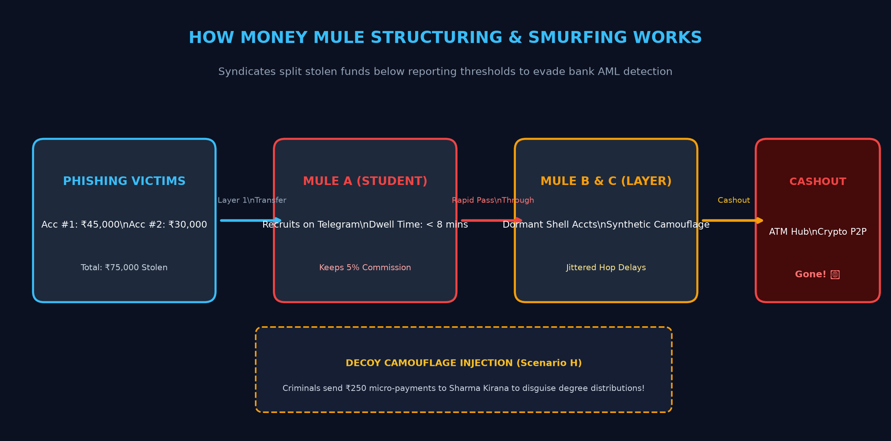
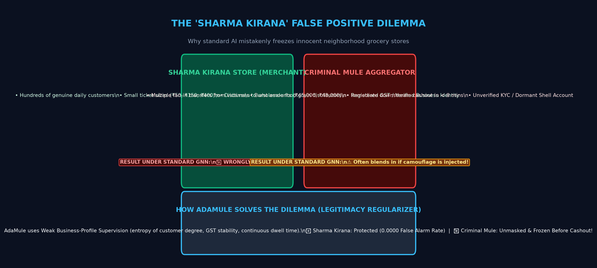

# 01. What is this Project?

## 1. The Real-World Crime: What is a Money Mule?

Imagine a cybercriminal syndicate steals **₹10,00,000 (10 Lakh Rupees)** through an online banking phishing scam.
The criminals **cannot** simply withdraw ₹10 Lakhs to their own bank accounts, because:
1. Indian banks (and international banks) flag any single transaction above ₹50,000 under AML (Anti-Money Laundering) regulations.
2. Police will immediately freeze their account and arrest them.

So what do criminals do instead?
They recruit **Money Mules**!
- **Who are money mules?** Often innocent college students, unemployed youth, or gig workers lured by fake "work-from-home" job ads or quick commissions.
- **The Technique (Smurfing & Structuring):**
  1. The criminal splits the stolen ₹10 Lakhs into 25 small transfers of ₹40,000 each (just below the detection limit).
  2. They route these transfers through student accounts (*Mule A*, *Mule B*, *Mule C*).
  3. Within 10 minutes, the students transfer the money to an ATM cashout terminal or buy cryptocurrency.
  4. The stolen money has now vanished into physical cash!

### 🖼️ Visual Diagram: How Money Mule Smurfing Works


```
[Phishing Victims] ---> (₹45k / ₹30k) ---> [Student Mule A] 
                                                  |
                                                  v (Rapid Pass-Through < 8 mins)
                                           [Dormant Mule B & C]
                                                  |
                                                  v (ATM / Crypto Cashout)
                                           [Stolen Cash Vanishes! 💸]
```

---

## 2. Why Traditional AI & Banks Fail

Banks tried using **Graph Neural Networks (GNNs)** to detect these money mule rings.
A GNN looks at bank accounts as **dots (nodes)** and transactions as **arrows (edges)**.

The GNN looks for accounts that have **high fan-in** (lots of money coming in from multiple people) and **high fan-out** (money going out quickly).

### 🚨 The "Sharma Kirana Store" Disaster (False Positive Trap)
Here is why traditional AI fails catastrophically in the real world:
- Think of your local neighborhood grocery store: **Sharma Kirana Store**.
- Every day, hundreds of local residents buy milk, bread, and groceries via UPI.
- Sharma Kirana has **hundreds of incoming payments** every morning, and in the afternoon, the shopkeeper transfers money to wholesale grain suppliers.
- **Traditional GNNs (like standard GCN, GAT, and CARE-GNN) cannot tell the difference between a criminal money mule aggregator and Sharma Kirana Store!**
- As a result, standard AI triggers a **100% False Positive Rate (FPR = 1.0000)** on honest merchants! It freezes the bank accounts of innocent small business owners, causing public outrage and legal lawsuits for banks.

### 🖼️ Visual Diagram: The Sharma Kirana Dilemma


```
+------------------------------------+      +------------------------------------+
|   SHARMA KIRANA STORE (MERCHANT)   |      |      CRIMINAL MULE AGGREGATOR      |
|  • Hundreds of genuine customers   |      |  • Multiple victims funneling funds|
|  • Small retail ticket sizes       |      |  • Large structured bursts (₹48k)  |
|  • Verified GST business profile   |      |  • Dwell time < 8 mins to ATM hub  |
+------------------------------------+      +------------------------------------+
                  |                                           |
                  v                                           v
       [Traditional GNN View]                      [Traditional GNN View]
    🚨 WRONGLY FROZEN (False Alarm!)             ⚠️ BLENDS IN VIA CAMOUFLAGE!
                  |                                           |
                  +---------------------+---------------------+
                                        |
                                        v
                            [AdaMule Solution]
     ✅ Sharma Kirana: Protected (0.0000 False Alarm Rate)
     🚨 Criminal Mule: Unmasked & Frozen Before Cashout!
```

---

## 3. What AdaMule Does (The Core Objective)

**AdaMule** (*Adversarially Robust Graph Fraud Detection for Structuring-Evasive Money Mule Networks*) is an advanced Artificial Intelligence defense system designed to solve this exact dilemma.

### Its Two Core Objectives:
1. **Zero False Positives on Honest Merchants (`Hard-Negative FPR = 0.0000`)**:
   It uses an auxiliary **Legitimacy-Preserving Regularization Module** that reads business profile metadata (GST registration, retail transaction dispersion, consistent customer base). It guarantees that innocent businesses like *Sharma Kirana* are **NEVER** wrongly frozen.
2. **Adversarially Robust Detection against Evasion Attacks**:
   When smart criminals try to evade detection by:
   - Splitting transactions into micro-amounts (**Smurfing**),
   - Injecting fake payments to grocery shops to blend in (**Camouflage**),
   - Adding 4-hour delays between transfers (**Temporal Jitter**),
   
   **AdaMule still catches them** using **Fourier Continuous-Time Encodings** and **Min-Max Adversarial Retraining**.

---

## 4. Why We Made It Gamified and Interactive

AI research is often hidden behind dry terminal logs and math formulas that are hard to visualize.
To make this project exciting, memorable, and tangible, we built a full **Cyber Heist & AML War Room Web Application**:
- You can **play as the criminal syndicate boss (Red Team)** and try to launder ₹10 Lakhs.
- You can **play as the cyber defense investigator (Blue Team)** with interactive drag-and-drop physics graphs, 3D rotating cyber globes, voice recognition, and real-time transaction streaming!
