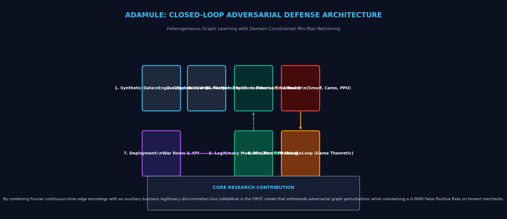
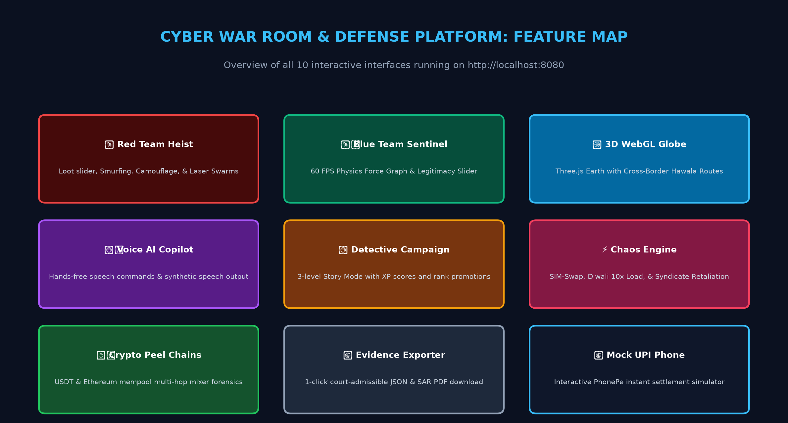

# 📚 AdaMule Project Description & Master Guide

Welcome to the **AdaMule Master Knowledge Base**. 

If you are wondering **"What is this project?"**, **"How does it work?"**, or **"What did we build?"**, this folder contains everything you need to know with both **descriptive text AND visual diagram images** illustrating every single concept.

---

### 🖼️ Master Architecture Overview

---

### 🖼️ War Room Interactive Features Map

---

## 📑 Table of Contents

1. [**01. What is this Project?**](01_WHAT_IS_THIS_PROJECT.md)
   - The real-world crime problem: Money Mules, Smurfing, and Laundering.
   - Why banks lose billions every year.
   - The "Sharma Kirana" False Alarm dilemma (why standard AI fails).
   - What AdaMule is and why it was created.
   - Includes **Visual Diagrams** on how money muling works and why Sharma Kirana gets wrongly frozen.

2. [**02. How It Works (Architecture & Dataflow)**](02_HOW_IT_WORKS_ARCHITECTURE.md)
   - Step-by-step pipeline: from transaction generation to graph neural networks.
   - How transactions become graph nodes and edges.
   - The Legitimacy-Preserving Regularizer (the secret sauce).
   - Min-Max Adversarial Retraining (how the AI trains against hackers).
   - Includes **Visual Diagrams & Empirical Benchmark Charts** (Recall, FPR, Ablation).

3. [**03. Every Single Feature Explained**](03_ALL_FEATURES_EXPLAINED.md)
   - Full walkthrough of all 10 interactive features:
     * Red Team Heist Simulator
     * Blue Team Sentinel & Physics Graph
     * 3D WebGL Cyber Globe (Three.js)
     * Voice-Activated AI Copilot (Web Speech API)
     * Cyber Detective Story Mode (Missions 1–3)
     * Live Chaos Engine & Stress-Tester
     * Crypto / Web3 Peel-Chain Forensics
     * Court-Admissible Evidence Bundle Exporter
     * PhonePe / UPI Mobile Simulator
     * Streamlit Multi-Tab Research Dashboard
   - Includes **Interactive Feature Map Diagram**.

4. [**04. Technology Stack & Libraries Used**](04_TECHNOLOGY_STACK.md)
   - Every language, framework, algorithm, and library used.
   - Why PyTorch, NetworkX, Three.js, Web Audio, and Web Speech were chosen.

5. [**05. Step-by-Step Run Guide**](05_STEP_BY_STEP_HOW_TO_RUN.md)
   - Clear, foolproof, copy-paste instructions to run every part of the project.
   - How to launch the web war room in 1 click.
   - How to run the automated benchmark experiments.
   - How to run the 27 unit tests.

6. [**06. Complete Codebase Directory Map**](06_COMPLETE_CODEBASE_DIRECTORY_MAP.md)
   - A complete tour of every folder, file, script, and configuration in this repository.

---
*Created automatically for full clarity, visual understanding, and technical transparency.*
